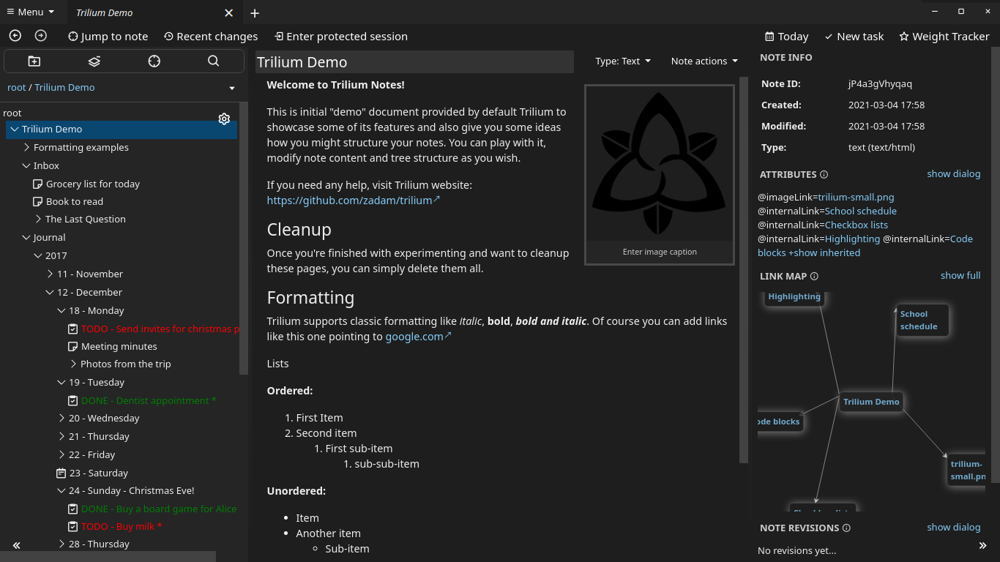

## Dark+ theme for Trillium Notes based on VS Code Dark+ Theme

License: `GNU General Public License v3.0`

## Installation:
 - create a note named: `dark-plus`
 - set note type to `Code` or `CSS`
 - copy the contents of [`dark-plus.css`](./dark-plus.css) file to that note
 - add a label attribute named: `appTheme`
 - go to `options -> appearence` and change the theme there
 - enjoy

## Features:
 - Compact
 - Flat design
 - Dark colors

### Made for Trilium Notes v0.43.4
### I am open for suggestions and pull requests
